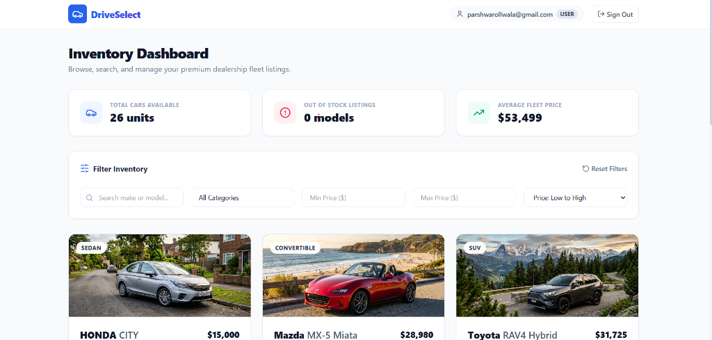
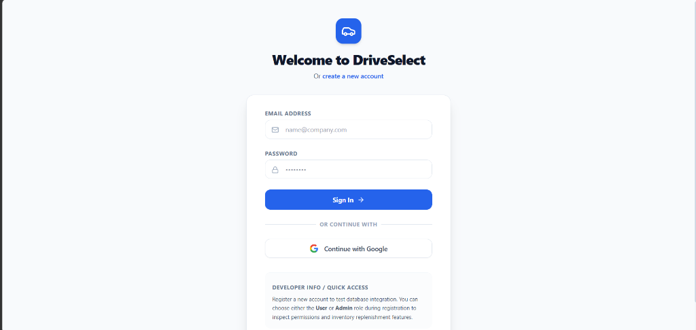
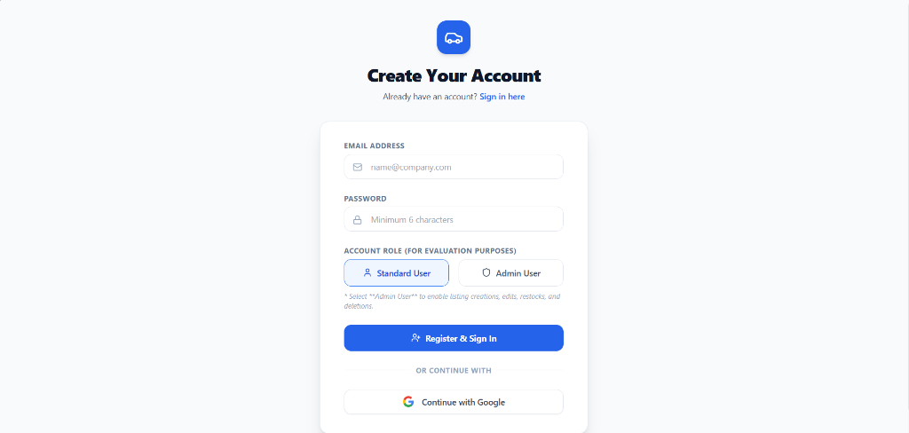

# DriveSelect: Car Dealership Inventory System

DriveSelect is a full-stack Car Dealership Inventory System built with clean TypeScript, Express, Prisma ORM with SQLite, React, and Tailwind CSS. The project is designed with a focus on Test-Driven Development (TDD), premium visual aesthetics, and solid developer ergonomics (e.g., zero-config SQLite database setup).

---

## Technical Stack & Architecture

- **Backend API**: Node.js + Express + TypeScript + Prisma ORM + SQLite
- **Frontend SPA**: React (v19) + TypeScript + Vite + Tailwind CSS + Lucide Icons
- **Testing Suite**: Vitest + Supertest (for backend integration) & Vitest (for frontend unit tests)
- **Database**: SQLite (persistent file-based database requiring zero external configuration)

---

## Key Features

1. **Token-Based Authentication**: Registration & login using JWT tokens and password hashing via `bcryptjs`.
2. **Dynamic Search & Filters**: Live client-side filtering on brand make, model, categories (Sedan, SUV, Coupe, Truck, Electric, etc.), and price ranges with sort options.
3. **Role-Based Controls**:
   - **Standard Users**: Browse listings, view live stock count badges, and purchase vehicles (which decrements stock levels in real time and disables the purchase button at zero).
   - **Admin Users**: Exclusive access to add new vehicles, update vehicle details, delete listings, and replenish stock levels via a dedicated admin hub or in-place card tools.
4. **Premium Visual Aesthetics**: Responsive grid system featuring gradient-based stylized car silhouettes that match the vehicle's category, smooth transitions, stat overview analytics, and custom scrollbars.

---

## Application Screenshots

### 1. Main Dashboard & Inventory Showcase


### 2. Login Screen (with Google Sign-In Sandbox option)


### 3. Registration Screen (with Standard/Admin role selector)


---

## Local Setup & Run Guide

Follow these steps to run the application locally on your machine.

### Prerequisites
- Node.js (v18 or higher recommended)
- NPM (v9 or higher)

### 1. Backend Setup
1. Open a terminal and navigate to the backend folder:
   ```bash
   cd backend
   ```
2. Install dependencies:
   ```bash
   npm install
   ```
3. Sync database schemas and generate Prisma Client (creates local `dev.db` file):
   ```bash
   npx prisma db push
   ```
4. Seed the database with 9 premium vehicles (Tesla, Porsche, BMW, etc.):
   ```bash
   npx prisma db seed
   ```
5. Run the server in development mode (listens on port `5000`):
   ```bash
   npm run dev
   ```

### 2. Frontend Setup
1. Open a new terminal window and navigate to the frontend folder:
   ```bash
   cd frontend
   ```
2. Install dependencies (using legacy peer deps to bridge React 19 dependency bounds):
   ```bash
   npm install --legacy-peer-deps
   ```
3. Run the frontend development server (starts on port `5173`):
   ```bash
   npm run dev
   ```
4. Open your browser and navigate to `http://localhost:5173`.

---

## Running the Test Suite

We follow a strict **Test-Driven Development (TDD)** lifecycle. You can execute the test suites on both the backend and frontend.

### Backend Integration Tests (28 tests)
Verify register, login, CRUD restrictions, searches, purchases, and restocking locks:
```bash
cd backend
npm run test
```

*Test Suite Output Summary:*
```text
 ✓ src/__tests__/vehicles.test.ts  (14 tests) 1174ms
 ✓ src/__tests__/inventory.test.ts  (8 tests) 757ms
 ✓ src/__tests__/auth.test.ts  (6 tests) 947ms

 Test Files  3 passed (3)
      Tests  28 passed (28)
```

### Frontend Unit Tests (6 tests)
Verify case-insensitive search queries, categories, price thresholds, and sorted results:
```bash
cd frontend
npm run test
```

*Test Suite Output Summary:*
```text
 ✓ src/__tests__/filters.test.ts  (6 tests) 20ms

 Test Files  1 passed (1)
      Tests  6 passed (6)
```

---

## TDD Demonstration (Interview Walkthrough)

To make it easy to demonstrate the Test-Driven Development (TDD) cycle during interviews, we have included a simple, self-contained unit test demo inside the backend:
- **Test Specification**: [demo.test.ts](file:///C:/Users/Dell/.gemini/antigravity/scratch/car-dealership-inventory/backend/src/__tests__/demo.test.ts)
- **Implementation**: [demo.ts](file:///C:/Users/Dell/.gemini/antigravity/scratch/car-dealership-inventory/backend/src/utils/demo.ts)

### How to Run:
Navigate to the `/backend` folder and execute the demo test suite:
```bash
npx vitest run src/__tests__/demo.test.ts
```

### The TDD Cycle Example:
1. **RED (Fail)**: If you temporarily change the return value inside `demo.ts` to `0`, running the test command will fail, printing assertions highlighting the mismatch.
2. **GREEN (Pass)**: Implementing the correct conditional checks (`role === 'ADMIN' ? price * 0.9 : price`) makes the test run pass successfully (turn green).
3. **REFACTOR**: You can clean up the code safely (e.g., extracting constants) knowing that running the test again will confirm no behavior was broken.

---

## Google Sign-In (OAuth Sandbox & Production Setup)

To showcase OAuth integration, we have implemented a **Simulated Google Sign-In Sandbox** on both the Login and Registration screens.

### How to use the Sandbox:
1. On the Login or Register page, click the **"Continue with Google"** button.
2. A simulated Google account chooser popup will open.
3. Select either the **Admin account** (`alex.admin@gmail.com`) or the **Customer account** (`john.buyer@gmail.com`).
4. The system will make a secure request to the backend `POST /api/auth/google`, auto-register or log in the user, issue a JWT token, and redirect you to the dashboard with the correct permissions.

### Production Guide: Transitioning to Real Google OAuth
To switch from this sandbox simulation to a real Google Cloud OAuth flow:
1. **Google Cloud Project**: Go to the [Google Cloud Console](https://console.cloud.google.com/), create a project, configure your OAuth Consent Screen, and generate a **Web Application OAuth Client ID**.
2. **Frontend Integration**:
   - Install the official library: `npm install @react-oauth/google` in `/frontend`.
   - Wrap the React App in the `GoogleOAuthProvider` with your Client ID.
   - Replace our custom popup button with the `<GoogleLogin>` component to receive the cryptographically signed `idToken` from Google.
3. **Backend Verification**:
   - Install Google verification library: `npm install google-auth-library` in `/backend`.
   - Update `authController.ts` `googleLogin` to verify the received token signature:
     ```typescript
     import { OAuth2Client } from 'google-auth-library';
     const client = new OAuth2Client(GOOGLE_CLIENT_ID);
     const ticket = await client.verifyIdToken({ idToken, audience: GOOGLE_CLIENT_ID });
     const payload = ticket.getPayload(); // contains verified email and name
     ```

---

## My AI Usage

### AI Tools Used
- **Antigravity**: An advanced AI pair-programmer acting as a co-pilot throughout this assessment.

### How I Used It
1. **Scaffolding and Boilerplate**: I asked Antigravity to generate the initial file structures for both backend (Express route mappings, Prisma schema declarations) and frontend components (Vite configuration, Tailwind configuration).
2. **TDD Workflow**: We worked together to implement tests *before* writing the logic. Antigravity generated the integration specs (e.g., auth registration, vehicle purchases), executed them to watch them fail (Red), and then helped write the clean Express controllers and services to pass them (Green).
3. **Refactoring**: I utilized Antigravity to isolate the client-side sorting and filtering logic from the `Dashboard` component into a pure function file (`filters.ts`), allowing us to write unit tests for it.
4. **Git Co-authorship**: For all commits, I appended Antigravity as a co-author using the `--author` or git trailers to maintain complete transparency.

### Reflection
The collaboration with AI drastically speeded up my development loops—specifically in generating boilerplate tests and writing repetitive schema typings. By letting the AI handle test structure templates, I was able to dedicate my energy to writing clean controller actions, ensuring database transaction isolation, and styling a high-quality CSS layout. Writing tests first (TDD) combined with AI-assisted code completion created a highly reliable loop with zero runtime bugs during the initial browser check.
